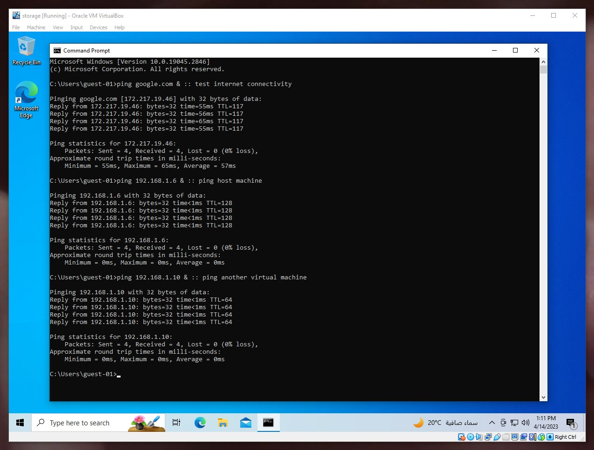
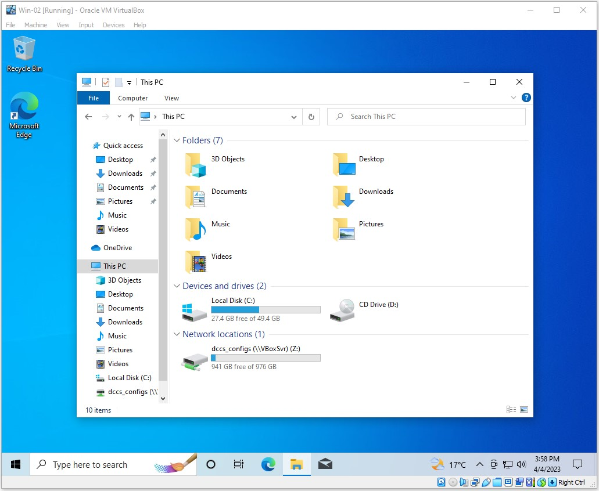
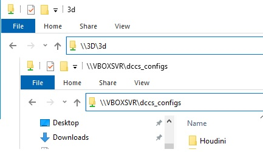

# Virtual Machines :
## Setup Steps : 
- Install **VirtualBox** 
- First Machine Setup
- Setup : **Windows Server** / **Windows Client**
- VMs Netwroking
- Setup **Virtual Network**

<br>

**Note** : Setup **Ubuntu** is almost the same as **Windows** but easier.

<br>

### Install **VirtualBox** : 
Go to [VBox Downloads](https://www.virtualbox.org/wiki/Downloads) <br>
and  download : <br>
- Windows hosts 
- Extension Pack

<br>

### First Machine Setup :
1) Download Windows as follows : [Download Windows](https://www.techworm.net/2022/08/download-windows-10-iso.html) <br>
2) Virtual Machine setup : <br>
   
   - Machine Name
   - Machine Folder
   - Iso Image
   - check **Skip Unattended** to skip creating user from VBox
   - Main Memory Size (RAM)
   - CPU
   - Display : Set to max
   - Secondary Memory Size (Hard Drive)
   - Set Type to **VDI**
<br>
<br>
1) Virtual Machine Settings : <br>
   
   - Set boot order : optical, Hard Drive
   - Make sure : optical -> Iso , Hard Drive -> Empty 
<br>
<br>
1) Windows Setup : <br>
   - Switch Host to airplane mode
   - Next, Next, Install 
   - Create Partitions
   - skip account and create user offline 
   - Next, Next, Install
<br>
<br>
1) Virtual Machine Settings : <br>
   - Remove Optical Drive 
   - Set boot order : Hard Drive
<br>
<br>
1) Windows Setup : <br>
   - VBox Menu: Devices > Insert Guest Additions, run 64 bit 
   - Format Partitions
   - System > Advanced System Settings > remote > allow remote connections
 
<br>

### Setup Windows Server / Client : 
- For server machine : setup **Windows Server**
- For client machines : setup **Windws Home** 

<br>

### VMs Networking : 
Two main categories for my usage <br>
1) **Bridge Adapter** <br>
   Allow VM to connect to your home network, your router will assign it an IP Address <br>
   You can use that IP to access VM from remote desktop app<br>
   
2) **Nat (Network)**<br>
   Allow VMs to connect to a virtual networ. <br>
   You can add a virtual network from VBox preferences.<br>
   You may need to allow remote connections.<br>
<br>

### Setup a Virtual network :
Two options : 
- Rely on **VBox** as network controller. *i.e.Do nothing but setting Nat(Network) option*
- Setup windows server VM as network controller
  1) Network Setup/ Domain Setup
  2) Promot **Windows Server** to **Domain Controller**
  3) Join clients to domain *i.e.get IP address from server*.
  4) Create users ? 
  5) Connect clients to internet through **Windows Server** ?

<br>

---

<br>

## My Daily Usage :
### Steps : 
   - Assign this network in VM settings : **Bridge Adapter**
   - Share from VM : Working Files , Assets Folder <br>
   [File sharing over a network in windows](https://support.microsoft.com/en-us/windows/file-sharing-over-a-network-in-windows-b58704b2-f53a-4b82-7bc1-80f9994725bf)
   - You may want to move **VM** to a another location [see how](https://www.youtube.com/watch?v=XB5P-K0yCEU)

   <br>

### Key Notes :  
   - Each Machine will be assigned an **IP address**
   - You can set a **static IP** for a certain Machine
   - You can host a server *e.g. HTTP Server* on **Virtual Machine** which will be accessible for all machines on the same network
   - You can share folders from **Host Machine** as well as **Virtual Machines**
   - Each Machine will have an internet access through this Virtual Network
   - Shared Folder from **Host** : `\\vboxsvr\shared-folder`
   - Shared folder from **Guest** : `\\Machine-Name\shared-folder`
  

<br>

*<center>Test network and Internet Access</center>*

<br>

*<center>Shared Config Folder</center>*

<br>

*<center>Shared Folders over network</center>*

<br>

---
## Conclusion

By the end of these steps, you should be able to mimic the basic structure of a studio's network. 

### Basic Structure :
```
.
├── server machine 
├── pipeline machine 
├── storage machines
├── user machines
└── farm machines
```

   1. Server Machine : <br>
     A machines thats runs windows server which used to build studio's network.<br>
     For sake of simpilicty, I relied on **Virtual network** in **VBox** 
   <br><br>

   2. Pipline Machine : <br>
     In my scenario it's used for :
      - run studio production tool server *e.g. ftrack or kitsu*
      - run and store studio's database *e.g. Mongo DB for openpype*
   <br><br>

   3. Storage Machines : <br>
     A storage machine for each department :
      - 3d storage machine shares &emsp;&nbsp;`\\3d`
      - fx storage machine shares &emsp;&ensp; `\\fx`
      - comp storage machine shares  `\\comp`
      - share studio configuration folder as `\\pipeline\configs`
      - share studio repository [Tools, Scripts , HDAs, ... ] as `\\pipeline\repo` <br>
       Example Tools :
        - pipeline management tool 
        - farm managment tool
   <br><br>

   4. User Machines :  <br>
     A machine for each department. you can create one and duplicate it as much as you want as they all share the same setup.<br>
     For sake of simpilicty, you can create just one machine.
   <br><br>

   5. Farm Machines : <br>
     Machines that shared among users.<br>
     You can use users machines as farm machines.<br>
     These machines are controlled and monitored via **Farm Managment Tool**.<br><br>

---
### Basic Studio Setup : 

For a studio that 
   - uses `kitsu` for production management
   - uses both `OpenPype` and `Prism 2.0` for pipeline management


Machines : 
  - 2 Pipeline Machine <br>
  - N Storage Machines for N departments <br>
  - M User Machines for M users <br>
  - K Farm Machines <br>

---
### My Setup:

   - 2 Virtual Pipeline Machine
   - 1 Virtaul Storage Machine 

   P.S. <br>
   >VirtualBox has limited support for 3D graphics, some DCCs may work and some may not <br>
   >So I use my host machine as a user / farm machine! <br>
   

   VM Machines Specs : 
   - Pipeline Machine : 
     - system : Ubuntu 22.04.2 
     - processor : 1 core 
     - Ram : 2GB 
     - Storage up to : 50 GB 
   - Storage Machine : 
     - system : Windows 10 home
     - processor : 2 core 
     - Ram : 2GB 
     - Storage up to : 200 GB 
 
   

   
