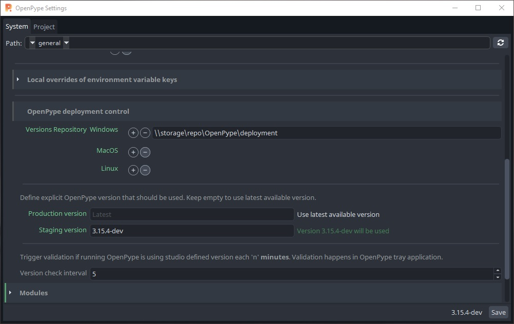

# Pipeline setup

In my experiment, I'm going to test 

- `openpype` and `prism 2.0` for pipeline management 
- `kitsu` for production management

> I chose `openpype` and `prism 2.0` as both supports **Kitsu** as well as **USD**

<br>

At this point I have : 
- 2 virtual pipeline machines
- 1 virtual storage machine that shares paths like these on network
 
    ```
    \\storage\repo
    \\storage\configs

    \\storage\3d
    \\storage\fx
    \\storage\comp
    ```


---

## Setup Kitsu : 
It needs someone who's familiar with linux. <br>
[Deploy kitsu for production guide](resources/guides/kitsu-deploy.md)

<br>

My setup : <br>
`pipline-pype` machine that runs `kitsu` and `MongoDB` for `openpype` projects <br>
`pipline-prism` machine that runs `kitsu` for `prism 2.0` projects <br>

---
## **OpenPype**

### Install OpenPype dependencies : 

You only need to setup **MongoDB Server**, I chose to install it on `pipline-pype` machine, 
[Install MongoDB 6 Community guide](resources/guides/mongodb-ubuntu.md)


### Install OpenPype and Basic Setup

- Download win installer from the latset release [OpenPype releases](https://github.com/ynput/OpenPype/releases)
- Installer will ask you for **Monogo URL** in OpenPype settings 
 
- Configure DCCs' environment variables and executable paths (this affects all users)
    > Admin → Studio Settings → Applications <br>
    > Each DCC app has its own user specified environment variables, [read more](https://openpype.io/docs/admin_settings_system#applications).

- Connect `openpype` to `kitsu` : 
  - Activate `kitsu` module in Admin Settings and add `kitsu`'s URL
  - Note that `openpype` sync with all `kitsu` projects and assets that complies to `openpype` naming rules  

    > This step is done once as it will be saved in `openpype`'s  database.
    ><br>
    >Naming convention:<br>
    >&emsp;At this moment names of assets, tasks, subsets or representations can contain only letters, numbers and underscore.

<br>

### Setup OpenPype CodeBase
- In my setup I made this [structure](resources/files/openpype_codebase/README.md) 
- Create new zip version as [pype-tools](resources/guides/pype-tools.md) to **Deployment folder**
- Add **Deployment folder** to **OpenPype System settings**
  
 


### Staging vs. Production

Staging version is for testing experimental features without disrupting production, [read more](https://openpype.io/docs/admin_distribute#staging-vs-production).

It's denoted by `orange color` and its version is next to save button.



### Create Staging Executable
In future, it may be createad by build script.<br>
But for now, You can create it using `.bat` file

1) Add [.bat](resources/files/openpype_staging_exe/opepype_gui_staging.bat) to your OpenPype installation path
2) Add [openpype_staging icon](resources\files\openpype_staging_exe\openpype_staging.ico) to `igniter` folder
3) Create shotrcut for the **.bat** file and change its icon, as [here](https://www.oreilly.com/library/view/java-garage/0321246233/0321246233_ch34lev1sec3.html).


<br>

---

## **Prism 2.0**  : 
### Prism 2.0 License
Firstly, Get `prism 2.0` license <br>
Email to: contact@prism-pipeline.com

### Install Prism 2.0 and Basic Setup
 - Install as follows [Prism Getting Started](https://prism-pipeline.com/docs/latest/index/getting_started.html)

    >P.S.<br>
    >This beta version of Prism Pipeline 2.0 is intended for testing purposes only.<br>It is not recommended to use it for commercial projects, but possible on your own risk.
   
 - Configure DCC apps executable paths (per user machine)
    > User Settings → DCC apps
 - Configure Environment Variables (this will affect all DCC apps)
    > User Settings → Environment

 - Connect `Prism 2.0` to `Kitsu` : 
    > Options → Project Management → Setup  <br>
    > Note that `prism 2.0` syncs with the selected `kitsu` project <br>
    > For more info: [Prism Kitsu](https://prism-pipeline.com/docs/latest/index/plugins/Kitsu.html)

<br>

> Note : <br>
> You can Use the same `kitsu` server with both `openpype` as well as `prism 2.0`  <br>
> As `openpype` will sync with all projects that complies to its naming convention <br>
> And `prism 2.0` can sync with the rest <br>

<br>

---

## De-activate prism initiation on start up

This step is recommended to avoid conflicts when `openpype` launches any DCC 

### In Maya
I use windows. These edits should be similar for other operating systems. 

- Edit userSetup.py 
    
    1) Go to `Documents\maya\MAYA_VERSION\scripts` 
    2) Replace `userSetup.py` by [this one](resources/files/maya/userSetup.py) 
   
    <br>

- Edit Prism Shelf

    1) Go to `Documents\maya\MAYA_VERSION\prefs\shelves`
    2) Replace `shelf_Prism.mel` by [this one](resources/files/maya/shelf_Prism.mel)

    <br>
    
### In Houdini
For default `prism 2.0` installation path

- Edit pythonrc.py 
    
    1) Go to `C:\ProgramData\Prism2\plugins\Houdini\Integration\pythonx.xlibs` , you'll find three pythonlibs folders 
    2) Replace `pythonrc.py` in each folder by [this one](resources/files/houdini/pythonrc.py)

    <br>

- Edit Prism Menu
  
  1) Go to `C:\ProgramData\Prism2\plugins\Houdini\Integration`
  2) Replace `MainMenuCommon.xml` by [this one](resources/files/houdini/MainMenuCommon.xml)
   
    <br>


---
## Appendix

### My Code standards : 

When editing any pre-made code, I comply to these rules

    Non destructive edits 
    Try to understand the impact of your edits on the software
    Try to see your edits from the big picture perspiective

    Html like enclosed tag `<custom_edits>` `</custom_edits>`  is used to denote the start and end of custom edits
