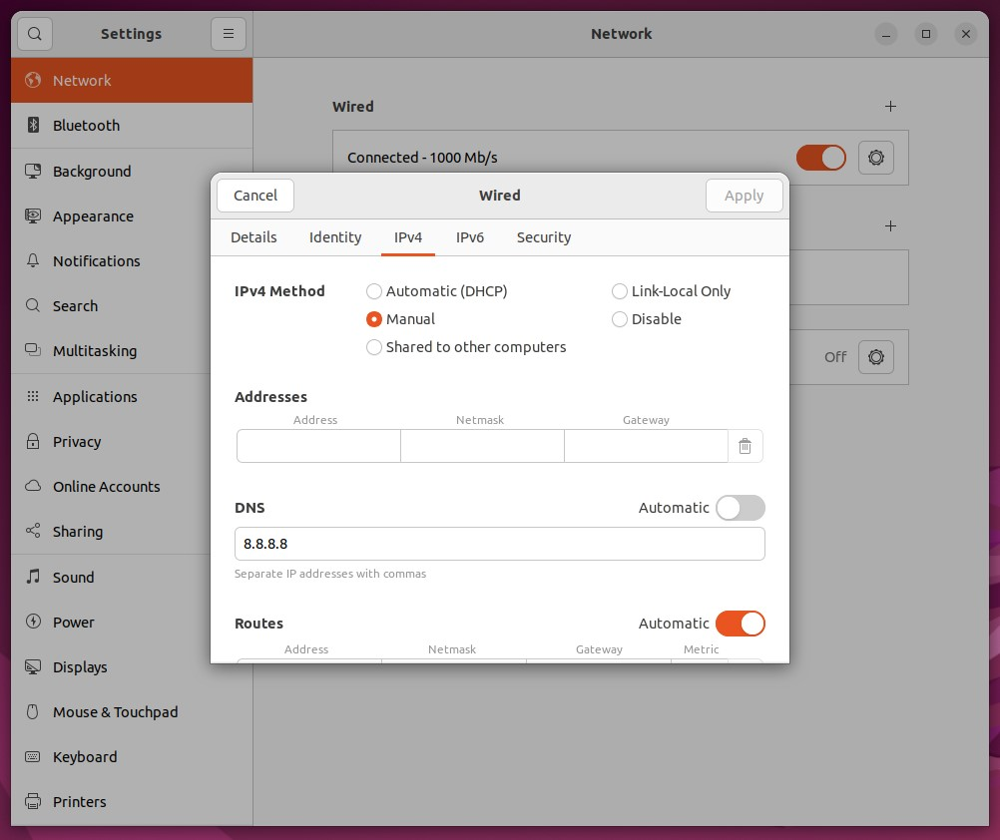

# Install MongoDB 6 Community Edition on Ubuntu

This doc is a summary of

- [mongodb docs](https://www.mongodb.com/docs/manual/tutorial/install-mongodb-on-ubuntu/)

- [YT Tutorial](https://www.youtube.com/watch?v=rdCk3YzW5os)

---
 

# Steps : 
## Reload local package database 
    
    sudo apt-get update

## Install prerequisites

    sudo apt-get install wget curl gnupg2 software-properties-common apt-transport-https ca-certificates lsb-release software-properties-common apt-transport-https ca-certificates lsb-release -y

## Import the public key
This step should return `OK` 

    curl -fsSL https://pgp.mongodb.com/server-6.0.asc | \
    sudo gpg -o /usr/share/keyrings/mongodb-server-6.0.gpg \
    --dearmor

> If it didin't return anything, Try this instead 

    wget -qO - https://www.mongodb.org/static/pgp/server-6.0.asc | sudo apt-key add -    

## Create a list file for MongoDB
This is a system specific command, check [mongodb docs](https://www.mongodb.com/docs/manual/tutorial/install-mongodb-on-ubuntu/#create-a-list-file-for-mongodb)

    echo "deb [ arch=amd64,arm64 ] https://repo.mongodb.org/apt/ubuntu jammy/mongodb-org/6.0 multiverse" | sudo tee /etc/apt/sources.list.d/mongodb-org-6.0.list 

## Reload local package database

    sudo apt-get update

## Install the MongoDB packages

    sudo apt-get install mongodb-org -y

## Test installation 

    mongosh --version 
    mongod --version

## Daemonize mongo

    sudo systemctl enable mongod
    sudo systemctl start mongod

## Check daemone status 

    sudo systemctl status mongod

## Mongo Config: Bind IP 
    sudo nano /etc/mongod.conf 

Edit the line with bind Id address 

    bindId: 127.0.0.1, ip_address

Then Restart mongod deamon

    sudo systemctl restart mongod

## Set Static IP
It's better to set a `static ip address` for your mongo machine from :

    Settings > Netowrk > gear icon > IPV4 

P.S.  
&emsp;If machine fails to connect to Internet, you may turn off `Automatic DNS` and set one like Google's own DNS server.

