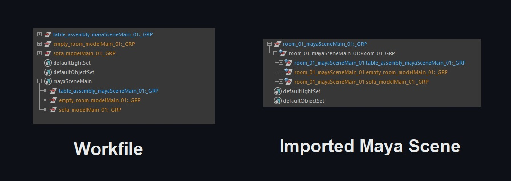

# Working with OpenPype in Maya

This file is a quick summary of [Openpype Maya](https://openpype.io/docs/artist_hosts_maya/)

## Openpype basic functionality :
- Publish 
- Load 
- Render

### Publish process 

1) Prepare your work for publishing 
2) Create family and set subset
   > Families are used to categorize data, [read more](https://openpype.io/docs/artist_publish)
3) Publish 
4) Deal with errors and re-publish

### Loading tools

- Load 
- Manage(Inventory)
   > It's used to update and change subsets loaded with Loader, [read more](https://openpype.io/docs/artist_tools_inventory)
- Library
   > It is extended loader which allows to load published subsets from Library projects.

## In this guide : How to Publish and load

- model 
- look (a material)
- rig
- animation
- assembly 
- point cache
- mayascene
- review

### Publish Model

1) Preparation : 
   - Group your objects 
   - Follow Naming Conventions  
        ```
        Suffices must be:
            - mesh:
                _GEO (regular geometry)
                _GES (geometry to be smoothed at render)
                _GEP (proxy geometry; usually not to be rendered)
                _OSD (open subdiv smooth at rendertime)
            - nurbsCurve: _CRV
            - nurbsSurface: _NRB
            - locator: _LOC
            - null/group: _GRP
            - animation contreller : _CTR
        Suffices can also be overridden by project settings.
        ```

2) Create family and set subset
   1) Select your group
   2) Go to **OpenPype → Create...**
   3) Select **Model** and set **Subset**     
        
3) Publish 
   1) Go **OpenPype → Publish....**
   2) Set **status** and click **▶** button
   
        

   3) Deal with errors and re-publish
        ```
         Left-Mouse-Click will show you more details
         Right-Mouse-Click will show you some actions 
         After fixing errors, you can Refresh Button then publish again
        ```
        

### Publish Model Example

https://user-images.githubusercontent.com/20871534/233054013-2eaacc25-b3d5-4b35-927e-0d4e5ed22324.mp4

### Load Model

1) Go to **OpenPype → Load...**
2) Select subset then **Right-Mouse-Click**

https://user-images.githubusercontent.com/20871534/233054096-77f7b60a-0a5a-40a6-a7a4-bb51f2ca0921.mp4

### Publish Look

1) Preparation, No certain preparation needed. you work as usual.
2) Create family and set subset
   1) Select the model or group that you want to publish its material 
   2) Go to **OpenPype → Create...**
   3) Select **Look** and set **Subset**
    
3) Publish: **OpenPype → Publish...** and click **▶** 

> Note :  <br>
> If there are textures in your material, they will be convered to `tx` format and saved as your pusblished material. <br>
> Original textures are only used in your working file!<br>
> Openpype does so to eleminate any dependency between published assets and artist's working files.<br> 

### Load Look

1) Go to **OpenPype → Load...**
2) Select subset then **Right-Mouse-Click**
   


### Load and Assign Look Example

Assign Look is an additional step to assign imported looks to imported models.

https://user-images.githubusercontent.com/20871534/233063666-94b7c3da-fe68-422a-a903-115483d657f3.mp4

> Model Credits : [Old Sofa](https://sketchfab.com/3d-models/old-sofa-3fe7ed15c42e48b8820792e8cef64f93)

### Publish Rig

1) Preparation:
   1) Rig Model as usual *Note: you should hide root joint*
   2) Add Controls as usual *Note: Use **_CTR** suffix*
   3) Prepare hierarchy as follows :
      
         ```
         asset_rig
         ├── geometry_GRP
         ├── rig_controls_GRP
         └── rig_GRP
         ```
         

2) Create family and set subset
   1) Select the model or group that you want to publish its material 
   2) Go to **OpenPype → Create...**
   3) Select **Look** and set **Subset**
    
3) Publish: **OpenPype → Publish...** and click **▶** 

### Load Rig

1) Go to **OpenPype → Load...**
2) Select subset then **Right-Mouse-Click**
   


### Publish Animation

1) Animate as usual
2) Publish: **OpenPype → Publish...** and click **▶** 

>As **Roy Nieterau** mentions in **ynput discord server** :
> For loaded animation rigs there's no need to manually create a publish instance. <br>
> It's automatically assumed it's loaded to have outputs produced for it.

### Load Animation

1) Go to **OpenPype → Load...**
2) Select subset then **Right-Mouse-Click**
   


How loaded animation hierarchy looks like


### Publish Assembly

1) Preparation: No Certain Preparation, you are free to group your objects or not 
   
2) Create family and set subset
   1) Select models or group that you want to publish its material 
   2) Go to **OpenPype → Create...**
   3) Select **Assembly** and set **Subset**
    
3) Publish: **OpenPype → Publish...** and click **▶**


### Load Assembly
> Loading Assembly is not working at the current time. April 20, 2023 


### Publish  Set dress / Layout

1) Preparation: No Certain Preparation, you are free to group your objects or not 
   
2) Create family and set subset
   1) Select models or group that you want to publish its material 
   2) Go to **OpenPype → Create...**
   3) Select **Layout** or **Set Dress** and set **Subset**
    
3) Publish: **OpenPype → Publish...** and click **▶**


> set dress vs layout <br>
> Currently set dress and layout are functionally identical
   
### Load  Set dress / Layout
1) Go to **OpenPype → Load...**
2) Select subset then **Right-Mouse-Click**


### Publish Maya Scene

> As **Toke Stuart** mentions in **ynput discord server** : <br> Maya scenes are just raw exports of the objectsets, so little to no validations. Meaning you can do anything within this family but that is also the danger.

1) Preparation: No Certain Preparation, you are free to group your objects or not 
   
2) Create family and set subset
   1) Select models or group that you want to publish its material 
   2) Go to **OpenPype → Create...**
   3) Select **Maya Scene** and set **Subset**
    
3) Publish: **OpenPype → Publish...** and click **▶**
   



### Load Maya Scene
1) Go to **OpenPype → Load...**
2) Select subset then **Right-Mouse-Click**


### Publish Point Cache
1) Preparation: No Certain Preparation, you are free to group your objects or not 
   
2) Create family and set subset
   1) Select models or group that you want to publish its material 
   2) Go to **OpenPype → Create...**
   3) Select **Maya Scene** and set **Subset**
    
3) Publish: **OpenPype → Publish...** and click **▶**


### Load Point Cache
1) Go to **OpenPype → Load...**
2) Select subset then **Right-Mouse-Click**

### Publish Camera
1) Preparation: No Certain Preparation.
   
2) Create family and set subset
   1) Select your camera
   2) Go to **OpenPype → Create...**
   3) Select **Camera** and set **Subset**
    
3) Publish: **OpenPype → Publish...** and click **▶**
   
### Load Camera
1) Go to **OpenPype → Load...**
2) Select subset then **Right-Mouse-Click**

### Publish Reviews
1) Preparation: No Certain Preparation.
   
2) Create family and set subset
   1) Select your camera
   2) Go to **OpenPype → Create...**
   3) Select **Review** and set **Subset**
    
3) Publish: **OpenPype → Publish...** and click **▶**


*<center>Publish Point Cache, Camera & Review</center>*

### Open Reviews
you can copy review path as follows.
